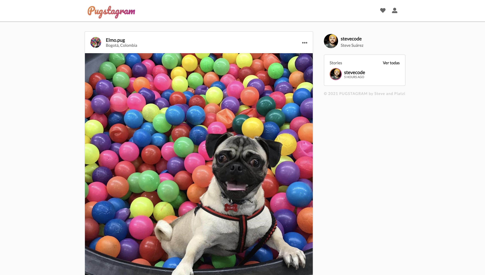

# Welcome to Pugstagram!

## How to use

1. Clone the repo
2. Use ```npm install``` to install all packages
3. Run Webpack Dev Server with ```npm run start```

## Preview



If you want to interact with the app just [see the app on production](https://pugstagram-stevecode.netlify.app/)

[](https://forthebadge.com)
